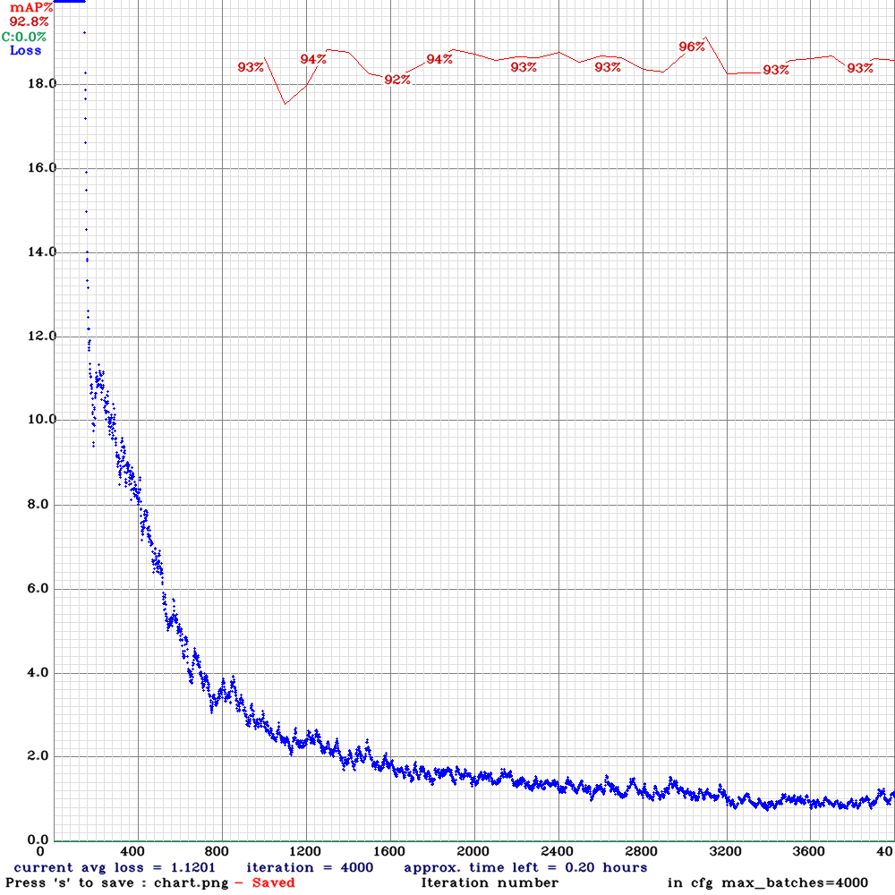

# QuickMask

Aiming to be a better real-time mask detection tool. 

This project is a CSE 490/599 final project. 

Check out our project video: TODO

## Introduction

### What is the problem

The world is not yet fully recovered from the COVID pandemic. Face mask mandates are still necessary to protect the public health. Therefore we would like to develop a tool that detects whether people are wearing their face masks in real time. 

### Dataset

We use the datasets provided on Kaggle: [source 1](https://www.kaggle.com/ashishjangra27/face-mask-12k-images-dataset), [source 2](https://www.kaggle.com/andrewmvd/face-mask-detection). 

We tried one approach for each dataset. The first dataset contains one people's face with and without mask each image. In total, the whole dataset contains 11.8k images. 

The second dataset contains people wearing and not wearing face masks. Each photo has different backgrounds and may contain multiple people. There is also a descriptive file that describes the bounding box of people's faces. In total, the whole dataset contains 853 images. 

### Team

Mike Nao

Bowen Xu

## Approach

### What techniques did we use?

We started the training with the pretrained EfficientNetV1 model. We use EfficientNetV1-b5 model with ImageNet pretrained weight first. Here are the initial configuration of optimization and hyper parameters. 

- Optimizer: SGD

- Loss: Cross Entropy Loss

- Weight decay: 0.0005

- epochs: 10

- batch_size: 8

- learning rate schedule: `{0: 0.09, 5: 0.01, 15: 0.001, 20: 0.0001, 30: 0.00001}`

- image resolution: 512

Later in the project,  we experimented with other configurations to improve the test accuracy. The experiments include:

- With pretrained weights vs without pretrained weights
- 10 epochs vs 20 epochs
- With learning rate schedule vs without learning rate schedule (`{0: 0.09}` only)
- EfficientNetV1-b5 vs EfficientNetV1-b0

We found out that the first dataset and the nature of binary classification was simple enough such that a small b0 network can achieve a great accuracy (98.8% accuracy). 

| Configuration                      | Result |
| ---------------------------------- | ------ |
| Original configuration (see above) | 98.8%  |
| 20 epochs                          | 98.1%  |
| b0 model                           | 98.8%  |
| b0 model, no pre-train             | 96.2%  |
| b5 model, no pre-train             | 98.4%  |
| no learning rate scheduler         | 68.6%  |

TODO generate graphs

We then tried our model with video frames. We used the OpenCV package to extract video frames and fed them to our model. The results from the video were bad - almost all frames are detected as "wearing a mask". During the investigation, we found that the first dataset only contained people's faces with little human body and background . A video feed from the real world, however, almost always contains a complex background. 

To use our initial model as a real-time face mask detection tool, we then proposed the following pipeline. Firstly, we need another model to extract faces from a video frame. Secondly, we feed the model with use the model to predict image. We quickly found that the face extraction model is also an object detection model by itself. Thus we decided to look for one uniform solution that's quick, accurate, and in real-time. 

### More investigation leads to YOLOv4

Upon more research, we discovered and decided to use a state of the art objection detection model - YOLOv4. We used our second dataset which contains multiple faces per image with their bounding boxes. We then wrote a script to transform the given label format to yolo label format. We changed some configurations to train our model:

- batch_size: 64
- subdivision: 32
- resolution: 512 * 512
- max_batches: 4000
- line_steps: 3200, 3600
- number of classes: 2
- yolo output filters: 21

We trained our model for about 10 hours and reach a best mAP of 96%. 

We tested the our best YOLO model with a video recording. In the video, Mike put on and took off the masks for multiple times. Our video model quickly and accurately responded to Mike's movements and updated the prediction correctly. 

## Discussion

### Conclusion

We trained our face mask detection model that achieved a best mAP of 96% with low reference time. In the video test, we found that the model was very responsive to movements and could accurately detect whether people are wearing a face mask or not. 

### Next steps

Our model was efficient - it only took 23ms to analyze a video frame. Thus a future step would be to deploy this to a server with more compute power to allow real-time mask detection. 

## References

We referred to the YOLO project [repo](https://github.com/AlexeyAB/darknet). 